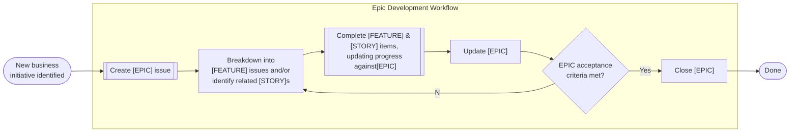
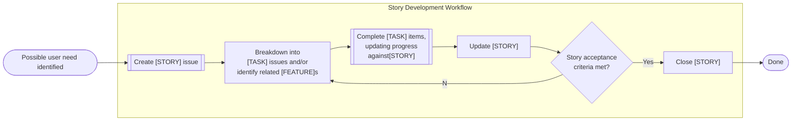
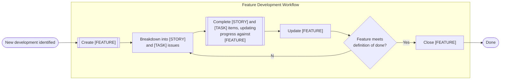
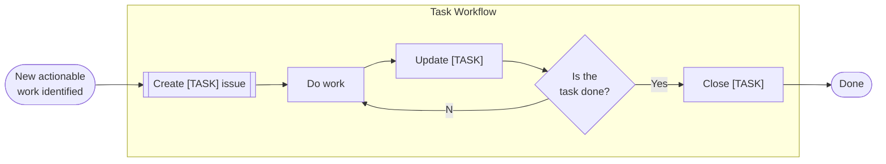
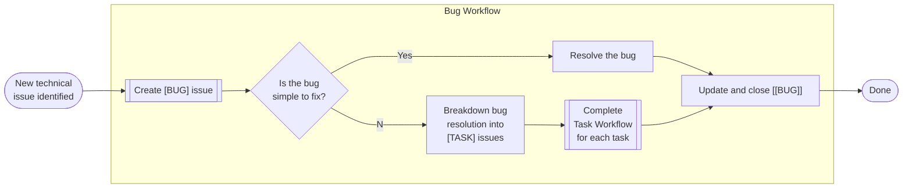

# Product & Development Workflows

## High Level Overview

From a development-focussed perspective we want to be able to understand user needs and requirements across all of the projects that we work on, plan how we can develop our software and platforms to meet these needs, and keep track of code to be written and bugs to be fixed. This helps with understanding what needs to be done, what the priority is, and how the work can be split based on available capacity in the team.

Development related items may arise from [operational workflows](./operational-workflows.md) or may be raised directly by the team. The below workflows give examples of how different items may be thought through, but are not prescriptive and are intended as guidelines.

## Examples

### Epic Workflow

Groups of related [FEATURE] and [STORY] issues may roll up into an [EPIC] that represents a larger initiative to be accomplished. Alternatively an identified [EPIC] may need to be broken down into [FEATURE] and [STORY] issues.

### Story Workflow

User needs can be recorded through the creation of a [STORY] issue. If selected for development, they can be broken down into [TASK] items that implement the needed functionality, or if part of a set of related user needs, rolled up into a [FEATURE].

### Feature Workflow

Larger pieces of development, defined directly by the MIRSG team, or through the aggregation of user needs can be recorded as a [FEATURE] issue. If selected for development, they can be refined and broken down into [STORY] and [TASK] issues to track their implementation.

### Task Workflow

[TASK] issues may result from the breakdown of larger work items, or be directly defined. They usually represent a defined piece of work that can be completed in a short timeframe - e.g. a day.

### Bug Workflow

Through [operational workflows](./operational-workflows.md), other development tasks, or serendipitous discovery, bugs may be identified and tracked in a [BUG] issue.
Simple bugs may be addressed directly in a branch and closed with a PR, whilst more complex ones may require the creation of several [TASK] issues.

