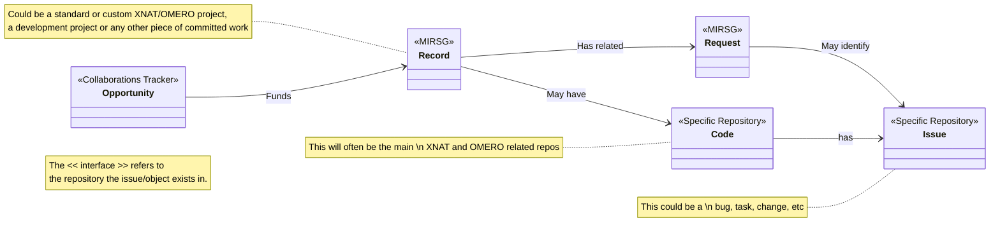
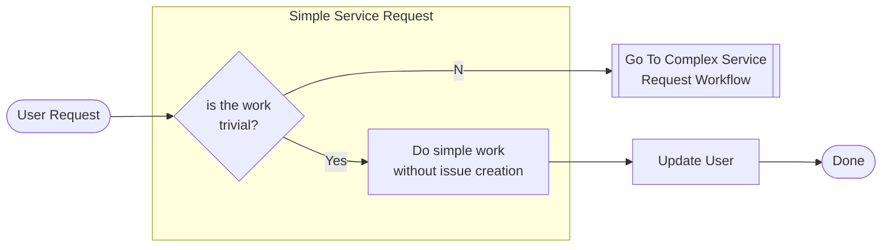
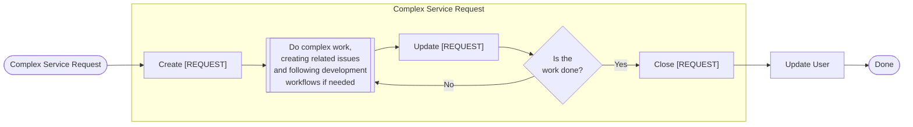
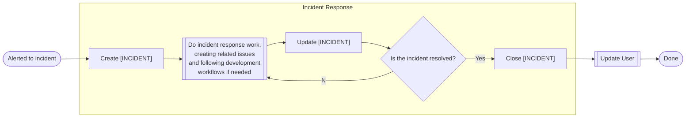

# Service & Operational Workflows

## High level Overview

From a service-focussed perspective we're interested in keeping track of projects that we support, ensuring that they are funded and issues raised by users are efficiently and effectively dealt with. This repository is the location where all project-like pieces of work MIRSG support are tracked as a **[RECORD]**, as well as non-trivial service items raised (as a **[REQUEST]**).

In the course of dealing with service & operational work, development-related items may need to be raised in project-specific code repositories, or within this repository for group-wide items. More details from the [development perspective can be found here](./development-workflows.md).

## Example Workflows

### Simple Service Request

Simple requests (e.g. adding a user to an XNAT project) do not need a [REQUEST] issue created to track them. They can be done immediately, and the user updated.
If the request requires research and thought, then follow the complex service request workflow to ensure actions taken are recorded for future reuse.

### Complex Service Request

Some requests will require a significant amount of work before they can be completed and closed (e.g. a question about how to use the OHIF viewer in a new way).
In these cases creating a [REQUEST] issue provides a place to record important actions taken.
This allows the knowledge gained to be stored centrally, helps us keep track of what still needs to be done, and how it can be planned in amongst other work items.

### Incident Response

Incidents are failures or significant degradations in services that we provide. Each of these should be recorded as a new [INCIDENT] to allow us to more effectively communicate about live incidents and to learn from past ones.

### New Standard XNAT Project

1. Receive a request to cost in a new XNAT project
2. Create an **[Opportunity]** issue in the *Collaborations Opportunity Tracker repository*
   1. Work-up and cost the XNAT project recording information in the **[Opportunity]**
   2. Follow-up and update the **[Opportunity]** following the usual Collaborations procedures
3. Once the **[Opportunity]** has started and work needs to be done, create a **[RECORD]** issue in the *MIRSG repository*
   1. (Optionally) Create a **[REQUEST]** issue in the *MIRSG repository* linked to the **[RECORD]** to track the set-up of the XNAT project
   2. Update the status in the **[RECORD]** making note of any non-standard actions needed.
4. After the project is running receive requests related to the project.
   1. If simple, complete the request straight away following the Simple Service Request workflow e.g. user account creation
   2. For more complex requests, follow the Complex Service Request: create a **[REQUEST]** issue in the *MIRSG repository* linked to the **[RECORD]** to track actions taken and discussion had in resolving the issue - e.g. debugging a researcher's issue with why uploads cut off after 1GB.
      1. You may need to work on the *specific repositories*' **[Code]** related to XNAT deployment, and create relevant general **[Issue]** entries as part of a [development workflow](./development-workflows.md) - e.g. researching the problem, finding the solution, updating the Nginx configuration in UCL-MIRSG/XnatInstaller and deploying the change.
      2. Once the work is completed, **[Code]** deployed, and related **[Issue]** closed, update and close the **[REQUEST]**