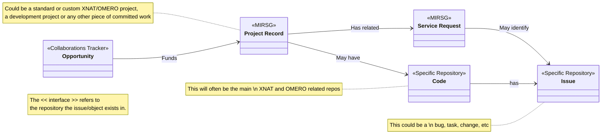

# UCL-MIRSG Development and Operational Management Structure

## Example Workflows

### Standard XNAT Project

1. Receive a request to cost in a new XNAT project
2. Create an **[Opportunity]** issue in the *Collaborations Opportunity Tracker repository*
   1. Work-up and cost the XNAT project recording information in the **[Opportunity]**
   2. Follow-up and update the **[Opportunity]** following the usual Collaborations procedures
3. Once the **[Opportunity]** has started and work needs to be done, create a **[Project Record]** issue in the *MIRSG repository*
   1. (Optionally) Create a **[Service Request]** issue in the *MIRSG repository* linked to the **[Project Record]** to track the set-up of the XNAT project
   2. Update the status in the **[Project Record]** making note of any non-standard actions needed.
4. After the project is running receive requests related to the project.
   1. If simple, complete the request straight away - e.g. user account creation
   2. For more complex requests, create a **[Service Request]** issue in the *MIRSG repository* linked to the **[Project Record]** to track actions taken and discussion had in resolving the issue - e.g. debugging a researcher's issue with why uploads cut off after 1GB.
      1. You may need to work on the *specific repositories*' **[Code]** related to XNAT deployment, and create relevant general **[Issue]** entries as part of a software development workflow - e.g. researching the problem, finding the solution, updating the Nginx configuration in UCL-MIRSG/XnatInstaller and deploying the change.
      2. Once the work is completed, **[Code]** deployed, and **[Issue]** closed, update and close the **[Service Request]**