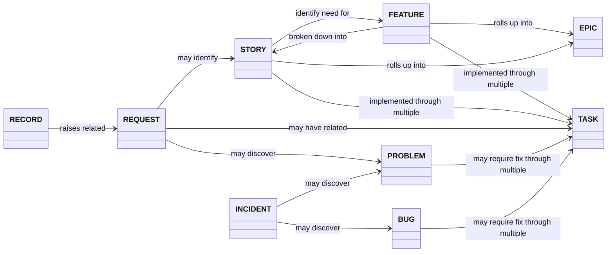

# Work Items and Issue Types

Across MIRSG-related repositories the following work items and issue types are defined and standardised.
This helps with planning and tracking information across all of our activities, and in pulling information together on the [MIRSG GitHub Project Board](https://github.com/orgs/UCL-MIRSG/projects/3).

## Summary of Implemented Issue Types

### Product & Development Focussed

- 🐳 **Epic** - A business initiative to be accomplished - usually through a set of related features and stories - *e.g. [EPIC] Enable compute integration with XNAT*
- 💼 **Record** - Captures a "project" that either translates directly to an XNAT project or is a software development project - *e.g. [RECORD] XNAT support for the MRI-x project*
- ✨ **Feature** - A discrete and defined piece of functionality that fulfills user needs - *e.g. [FEATURE] Add support for XNAT Container Service via Kubernetes*
- 📝 **Story** -  A need or use case expressed from a user's perspective as “persona + need + purpose.”- *e.g. [STORY] As a researcher, I want to be able to run my analysis from XNAT, so that I don't need to move my data*
- ✏️ **Task** - Smallest unit of work to deliver a change - usually doable in a single day - *e.g. [TASK] Create a Kubernetes cluster*
- 🐛 **Bug** - Initial record of technical bugs, as well as ongoing discoveries. - *e.g. [BUG] Existing K8s permissions prevent access*

### Service & Operational Focussed

- 📥 **Request** - Details of a user request received, that may result in the creation of other work items. - *e.g. [REQUEST] Installation of analysis container*
- 🔥 **Incident** - An issue keeping track of degradations in service provision. - *e.g. [INCIDENT] XNAT Container Service is not connecting to compute*
- 🙅 **Problem** - Unplanned activities that may block work from getting done. Often challenges with specific XNAT/OMERO use cases. Can also be personnel or resource issues, or other risks that impact scope and quality. *e.g. [PROBLEM] Existing compute platform does not support Kubernetes*

## Relationships between Implemented Issue Types

The below diagram shows some possible relationships between issue types. Not all pieces of work will need to be broken down through these relationships, and it is encouraged for simple items to use a single issue.

Worked examples of how issues relate together in common workflows to track, breakdown and plan work are documented in [service-focussed](./operational-workflows.md) and [development-focussed](./development-workflows.md) workflows.

## Proposed but not Implemented Issue Types

- 👥 **Discussion** - A suggestion, idea, or request for comment to get documented consensus on a topic before committing to non-trivial work - *e.g. [DISCUSSION] How should we support compute?*

## Useful links

- [Microsoft CSE Code With Engineering Playbook - Work Items](https://microsoft.github.io/code-with-engineering-playbook/documentation/guidance/work-items/)
- [ISD.Agile Resource Hub - Agile Glossary](https://liveuclac.sharepoint.com/sites/ISDAgileResourceHub/SitePages/Glossary.aspx)
- [Atlassian Agile Project Management](https://www.atlassian.com/agile/project-management)
- [Pragmatic Engineer - RFCs and Design Docs](https://blog.pragmaticengineer.com/rfcs-and-design-docs/)
- [Bruno Scheufler - Documenting Design Decisions using RFCs and ADRs](https://brunoscheufler.com/blog/2020-07-04-documenting-design-decisions-using-rfcs-and-adrs)